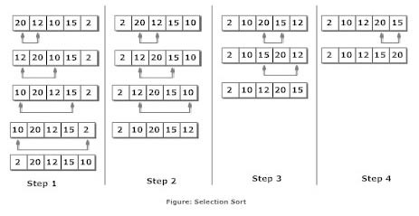

#C Cheatsheet
This repository explains the basics of the C programming language.

In this readme file, an introduction to the structures, operators, loops and conditionals is given.

In the main.c file, a real program coded in C, explains each of the functionalities in a practical way.
All the code is commented, just in case you have a doubt about how something is done.

## Types


## Operators

| Symbol | Meaning or Pronunciation     | “True” Comparison Examples |
|--------|---------------------------|----------------------------|
| <         | Less than                    | 1 < 5 / 8 < 9                |
| ==        | Equal to                     | 5 == 5 / 0 == 0              |
| >      | Greater than                 | 8 > 5 / 10 > 0               |
| <=        | Less than or equal to        | 4 <= 5 / 8 <= 8              |
| > =        | Greater than or equal to     | 9 >= 5 / 2 >= 2              |
| !=        | Not equal to                 | 1 != 0 / 4 != 3.99           |

There are also the && operator, which allows to do an AND.

Example: `if (x>1 && y>2)` --> Both conditions should be true to enter the if

The other operator is the ||, which allows to do an OR. 

Example: `if (x>1 || y>2)` --> Only one condition has to be true to enter the if

## Mathematical Operators


## Conditionals

### If/Else
if statement is the most simple decision making statement. It is used to decide whether a certain statement or block of statements will be executed or not i.e if a certain condition is true then a block of statement is executed otherwise not.
Here, condition after evaluation will be either true or false. C if statement accepts boolean values – if the value is true then it will execute the block of statements below it otherwise not.
Otherwise, we can use the else statement with if statement to execute a block of code when the condition is false.

```
int i = 20; 
  
if (i < 15) {
    printf("i is smaller than 15"); 
} else {
    printf("i is greater than 15"); 
}
```
**Output**:
```
i is greater than 15
```

### Switch
Switch case statements are a substitute for long if statements that compare a variable to several values.

```
#include <stdio.h> 
int main() 
{ 
   int x = 2; 
   switch (x) 
   { 
       case 1: printf("Choice is 1"); 
               break; 
       case 2: printf("Choice is 2"); 
                break; 
       case 3: printf("Choice is 3"); 
               break; 
       default: printf("Choice other than 1, 2 and 3"); 
                break;   
   } 
   return 0; 
}
```
**Output**:
```
Choice is 2
```

## Loops

### For Loop
A for loop is a repetition control structure which allows us to write a loop that is executed a specific number of times. The loop enables us to perform 'N' number of steps together in one line.

```
int i=0; 
for (i = 1; i <= 10; i++)
{    
    // body of the loop
    // statements we want to execute
    printf( "Hello World %d\n", i);
}
```
**Output**:
```
Hello World 0
Hello World 1
Hello World 2
Hello World 3
Hello World 4
Hello World 5
Hello World 6
Hello World 7
Hello World 8
Hello World 9
```

### While Loop
While loops are used in situations where we do not know the exact number of iterations of loop beforehand. The loop execution is terminated on the basis of test condition.

```
int i=0; 
while (i < 6) 
{    
    // body of the loop
    // statements we want to execute
    printf( "Hello World %d\n", i);
}
```
**Output**:
```
Hello World 0
Hello World 1
Hello World 2
Hello World 3
Hello World 4
Hello World 5
```

### Do While
The main difference between do while loop and while loop is in do while loop the condition is tested at the end of loop body.

In do while loop the loop **body will execute at least once** irrespective of test condition.

```
int i=0; 
do
{ 
    // loop body 
    printf( "Hello World %d\n", i);     

    // update expression 
    i++; 

}  while (i < 3);   // test expression 
```
**Output**:
```
Hello World 0
Hello World 1
Hello World 2
```
### Extra
Sometimes, we want to leave a loop before the condition is reached. To do so, we can use the break statement (can be used with any loop type).

Let's take for example a program where we want to find a number in an int array:
```
#include <stdio.h> 
  
void findElement(int arr[], int size, int key)  
{  
    // loop to traverse array and search for key  
    for (int i = 0; i < size; i++) {  
        if (arr[i] == key) {  
            printf("Element found at position: %d", (i + 1));  
            break;  //If the number is found, we leave the for loop with the break statement 
        }  
    }  
}  
  
int main() { 
    int arr[] = { 1, 2, 3, 4, 5, 6 };  
      
    // no of elements 
    int n = 6;   
      
    // key to be searched  
    int key = 3;  
  
    // Calling function to find the key  
    findElement(arr, n, key);  
  
    return 0; 
} 
```
**Output**:
```
Element found at position: 3
```

## Arrays


### Sort Array
The most simple way to sort an array, is using the Selection Sort method.

The array can be sorted in ascending order by repeatedly finding the minimum element (considering ascending order) from unsorted part and putting it at the beginning. The algorithm maintains two subarrays in a given array.



```
void selectionSort(int arr[], int n) 
{ 
    int i, j, min_idx; 
  
    // One by one move boundary of unsorted subarray 
    for (i = 0; i < n - 1; i++) { 
  
        // Find the minimum element in unsorted array 
        min_idx = i; 
        for (j = i + 1; j < n; j++) {
            if (arr[j] < arr[min_idx]) {
                min_idx = j; 
            }
        }
  
        // Swap the found minimum element 
        // with the first element 
        int temp = arr[i];
        arr[i] = arr[min_idx];
        arr[min_idx] = temp;
    } 
} 
```


## Structs


